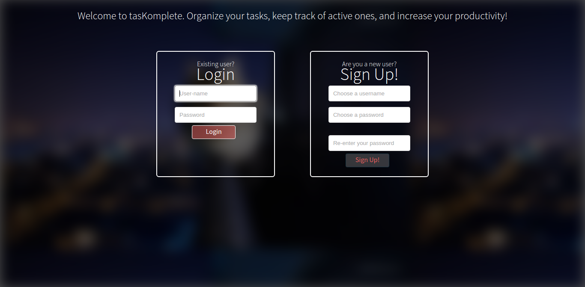
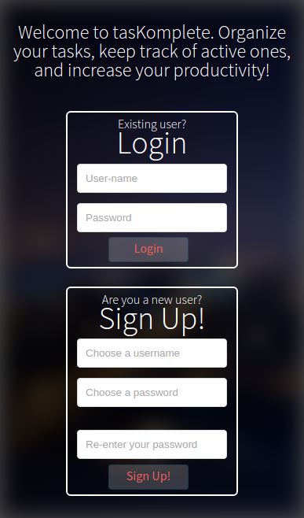
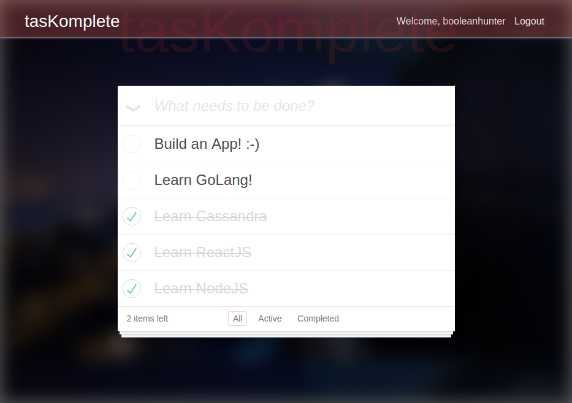

# tasKomplete  :heavy_check_mark:

[](https://github.com/booleanhunter/tasKomplete/blob/master/LICENSE)

tasKomplete is a task management tool which helps you organize your daily tasks. Built using :

- NodeJS and ExpressJS
- MongoDB
- ReactJS
- Webpack

[Click here](http://ec2-52-74-208-196.ap-southeast-1.compute.amazonaws.com:9992) to see it live! 

#### 

### The Login Page

- On laptop



- On mobile



### The todos page



### Features:

- Sign-up and login mechanism
- View all your tasks, active tasks and completed tasks
- Responsive for web and mobile

The master branch is for production-ready code.

Contributed and maintained by :-

[@booleanhunter](http://ashwinhariharan.xyz)

## Steps to set up dev environment for using this repo

#### Instructions to run

- Fork or clone this repo
- Install nodejs and NPM
- Install MongoDB and Redis
- Go to the project folder tasKomplete-app from your terminal and run `npm install`
- Run `node app.js`
- Going to [http://localhost:9992](http://localhost:9992) will render the login page if you have't logged in. Upon logging in, you'll be redirected to 
[http://localhost:9992/mytodos](http://localhost:9992/mytotos)
- Use [React Developer Tools Chrome Extension](https://chrome.google.com/webstore/detail/react-developer-tools/fmkadmapgofadopljbjfkapdkoienihi?hl=en) to understand the components hierarchy and structure and to track down bugs.


#### For development

- React Hot Loader can be used to ease your development workflow. This can be done by installing dev dependencies from `package.json` file. If you haven't, then
run `npm install webpack-dev-server` and `npm install react-hot-loader`.
- Then in your HTML, change your javascript bundles' source paths to point to the webpack-dev-server proxy in your `script` tags. So if you have something
like this 

```html
<script src="/dist/js/vendors.js"></script>
<script src="/dist/js/app.bundle.js"></script>
```

change this to 

```html
<script src="http://localhost:8080/dist/js/vendors.js"></script>
<script src="http://localhost:8080/dist/js/app.bundle.js"></script>
```

For a detailed explanation on setting up a workflow using Webpack, check out my blog post - [Webpack for The Fast and The Furious](https://medium.com/@booleanhunter/webpack-for-the-fast-and-the-furious-bf8d3746adbd#.uzx2l0hy4) :-)

#### Acknowledgements

- Styles for the task-list is taken from [http://todomvc.com](http://todomvc.com/examples/react/#/active)
- Special thanks to [@hkoivuneva](https://github.com/hkoivuneva) for helping me with the responsiveness.